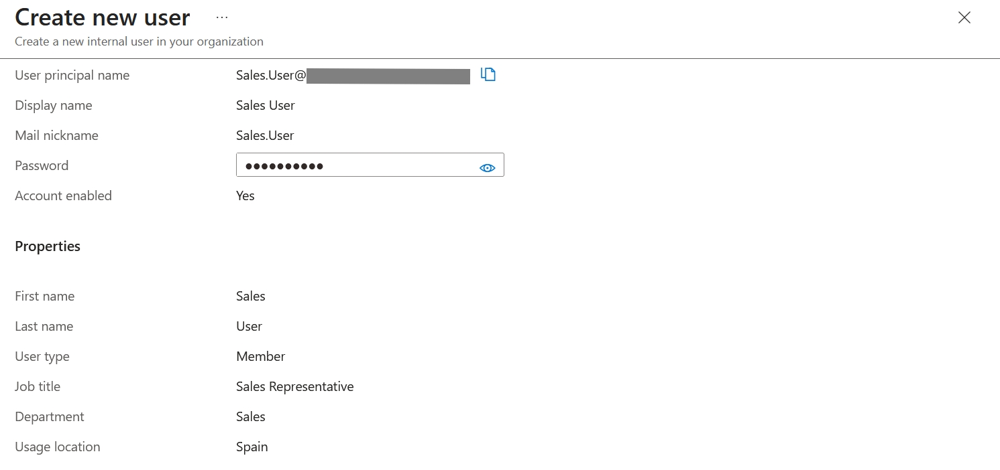
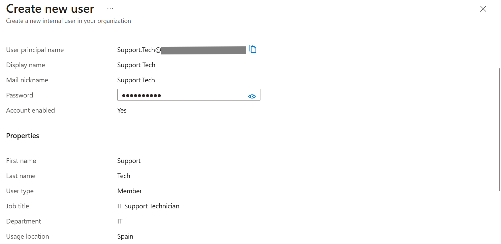
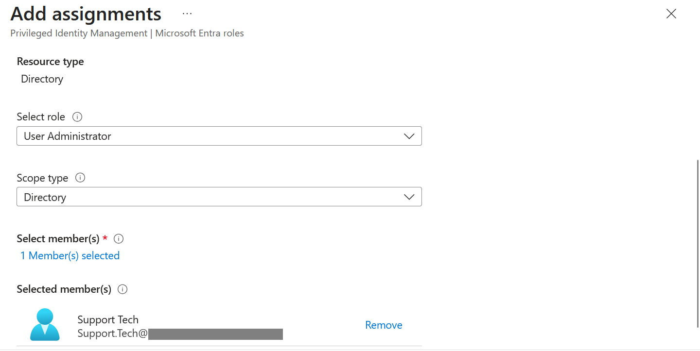
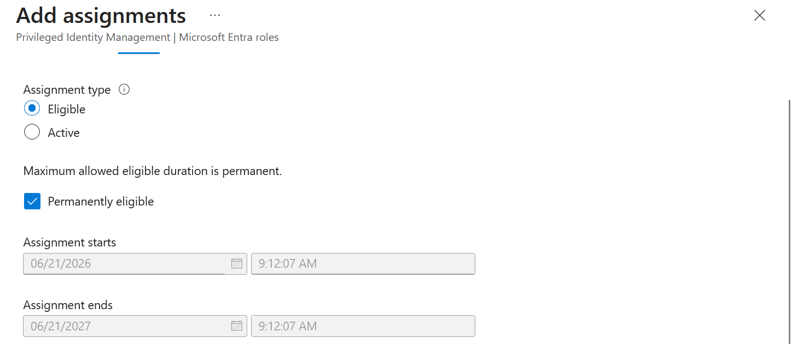
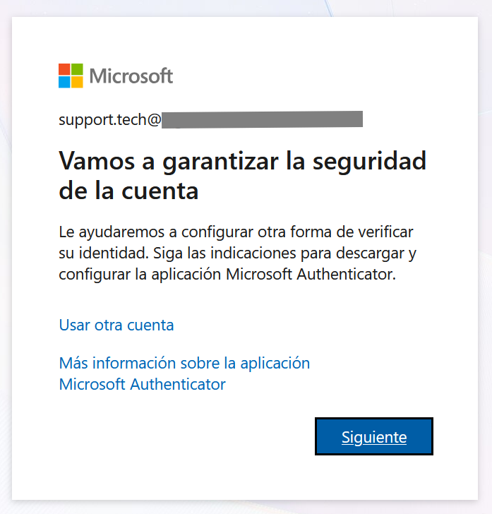
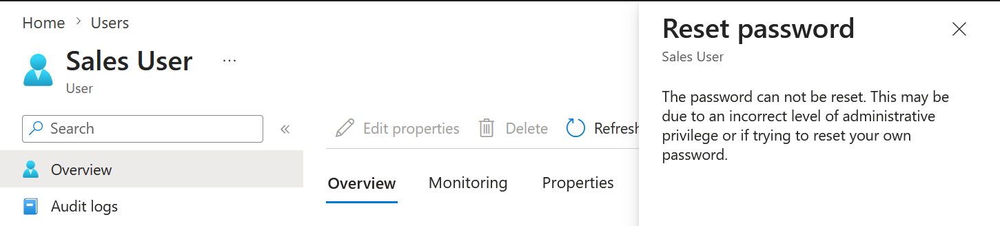
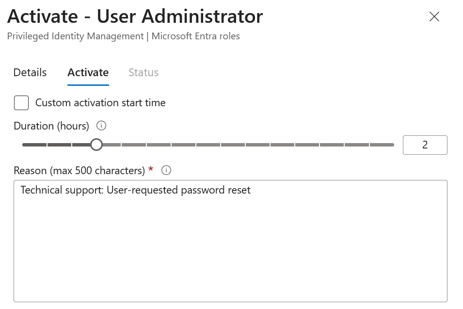
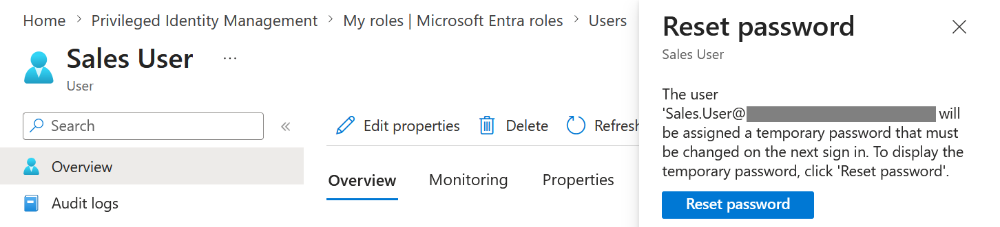
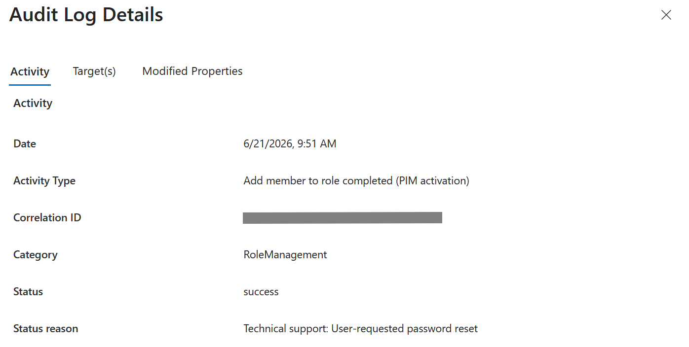

# Lab01 - PIM & Least Privilege

## Objective

Demonstrate how Microsoft Entra Privileged Identity Management (PIM) can be used to implement the Principle of Least Privilege through Just-In-Time (JIT) role activation.

## Scenario

A support technician needs to reset the password of a user from the Sales department.

Instead of granting permanent administrative privileges, the technician receives an Eligible assignment for the User Administrator role through Microsoft Entra PIM.

The role must be activated temporarily before performing administrative actions.

## Technologies Used

* Microsoft Entra ID
* Microsoft Entra Privileged Identity Management (PIM)
* Multi-Factor Authentication (MFA)
* Microsoft Entra Audit Logs

## Lab Steps

### 1. Create the target user

A standard user account representing a Sales department employee was created.

**Note:** Although Microsoft Entra allows administrative roles to be assigned during user creation, this method creates permanent active assignments. To implement a Least Privilege model with Just-In-Time (JIT) access, roles should instead be assigned later through Microsoft Entra Privileged Identity Management (PIM) using **Eligible** assignments.

---

### 2. Create the support technician account

A dedicated support account was created to perform administrative operations.

---

### 3. Assign User Administrator as Eligible through PIM

The User Administrator role was assigned as Eligible instead of Active.

This means the user does not receive administrative privileges until the role is activated.

---

### 4. Register Multi-Factor Authentication (MFA)

The support technician was required to register Microsoft Authenticator before performing privileged operations.

---

### 5. Verify access is denied before activation

An attempt to reset the Sales user's password failed because the role had not yet been activated.

This demonstrates the Principle of Least Privilege.

---

### 6. Activate the role using PIM

The support technician activated the User Administrator role for a limited period of two hours and provided a business justification.

---

### 7. Reset the user's password successfully

After role activation, the password reset operation became available.

---

### 8. Review audit logs

The PIM activation event was successfully recorded in Microsoft Entra audit logs, providing accountability and traceability.

---

## Key Security Concepts Demonstrated

* Principle of Least Privilege
* Just-In-Time (JIT) Access
* Privileged Identity Management (PIM)
* Multi-Factor Authentication (MFA)
* Audit and Accountability
* Identity Governance

## Outcome

This lab demonstrates how Microsoft Entra PIM reduces the risk associated with standing administrative privileges by requiring temporary role activation and maintaining full audit visibility of privileged operations.
