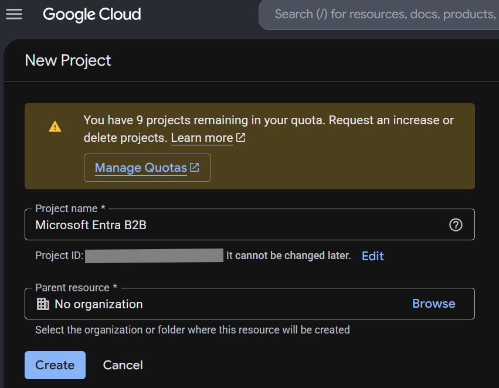
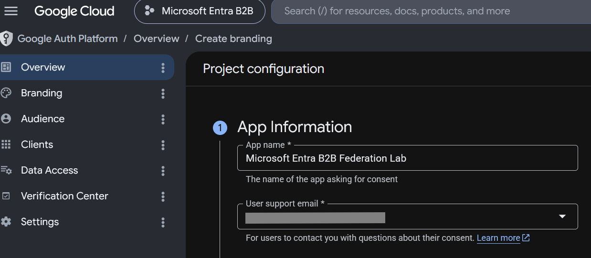
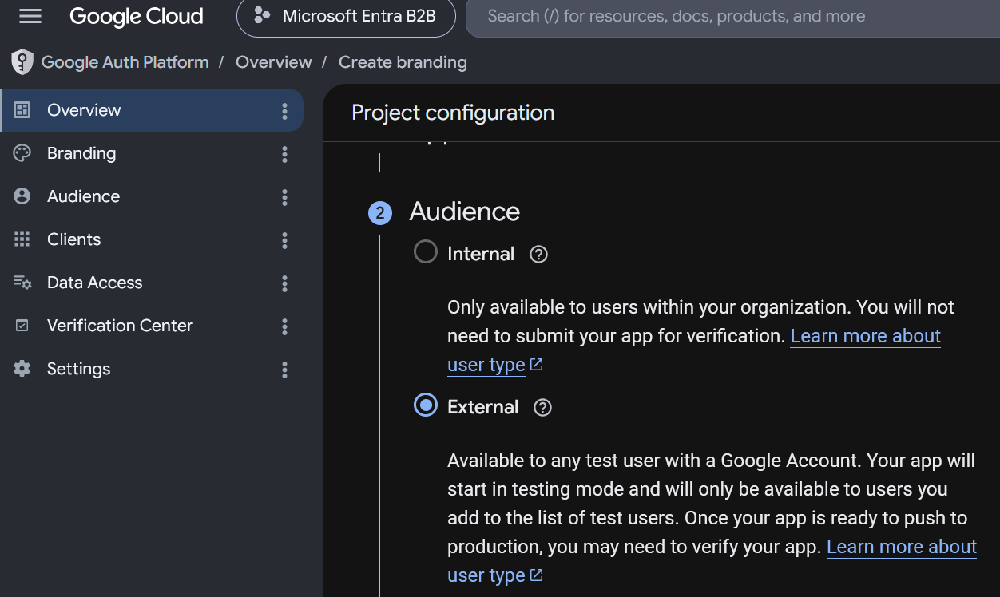
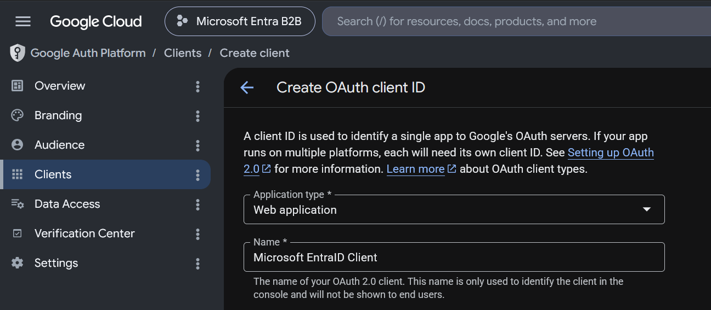
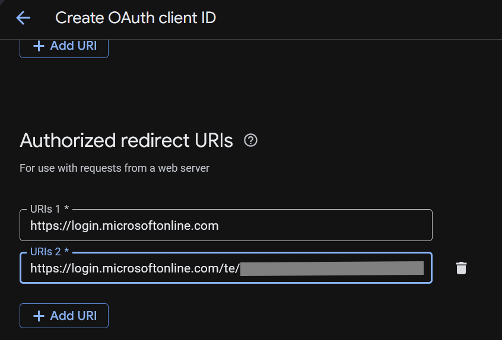
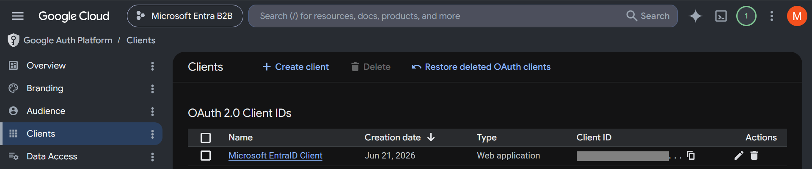
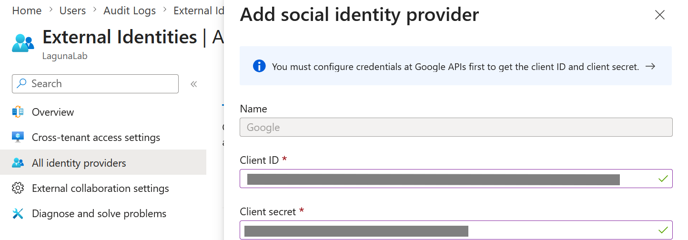
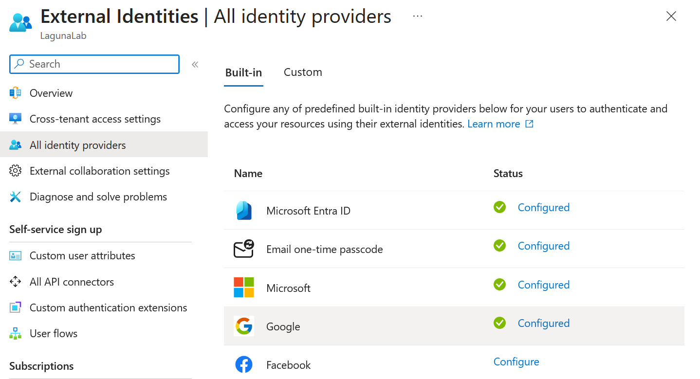

# Lab02 - Google Federation with Microsoft Entra External Identities

## Objective

Demonstrate how Microsoft Entra External Identities can federate authentication with Google using OAuth 2.0, allowing external users to authenticate with their Google accounts while Microsoft Entra maintains control over authorization.

## Scenario

An organization wants to allow external users with Google accounts to authenticate through Microsoft Entra External Identities.

To achieve this, Google is configured as an external Identity Provider (IdP) using OAuth 2.0 federation.

## Technologies Used

- Microsoft Entra ID
- Microsoft Entra External Identities
- Google Cloud Platform (GCP)
- Google Auth Platform
- OAuth 2.0

## Step 1 - Create a Google Cloud Project

A new Google Cloud project is created to host the OAuth configuration required for federation.

## Step 2 - Configure OAuth Branding

The OAuth consent screen branding information is configured.

## Step 3 - Configure the Audience

The application is configured as External so users outside the organization can authenticate.

## Step 4 - Create the OAuth Client

An OAuth 2.0 client is created using the Web Application type.

## Step 5 - Configure Redirect URIs

Authorized redirect URIs are configured to allow Google to return authentication responses to Microsoft Entra.

## Step 6 - Generate Client Credentials

Google generates the Client ID and Client Secret required for federation.

## Step 7 - Configure Google as an Identity Provider in Microsoft Entra

The Google OAuth credentials are configured in Microsoft Entra External Identities.

## Step 8 - Verify the Federation Configuration

Google appears as a configured Identity Provider in Microsoft Entra.

## Key Security Concepts Demonstrated

- Identity Federation
- External Identities
- OAuth 2.0
- Trust Relationships
- Authentication Delegation
- B2B Collaboration
- Identity Providers (IdP)
