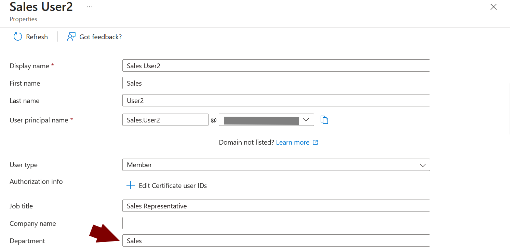
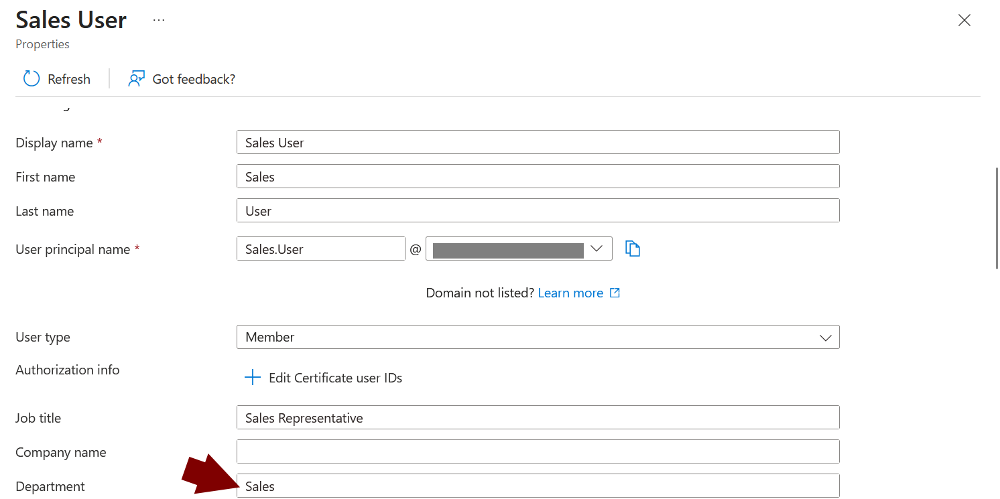
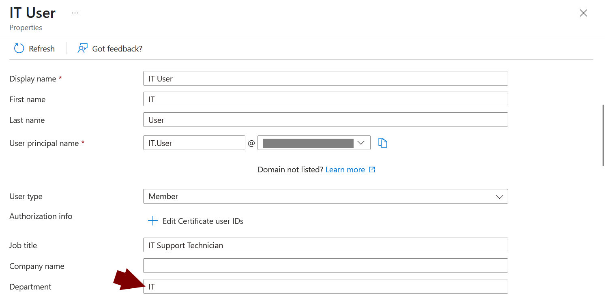
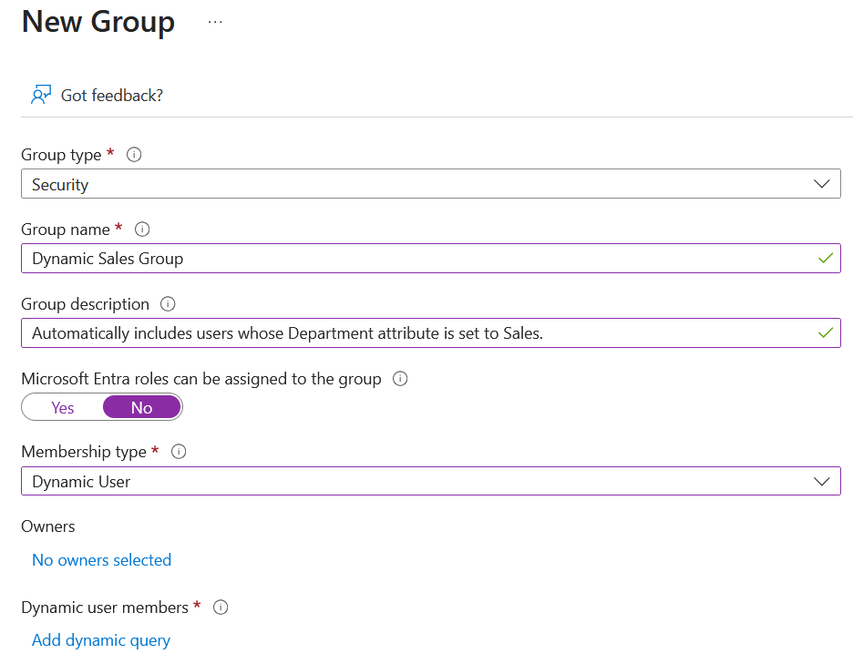
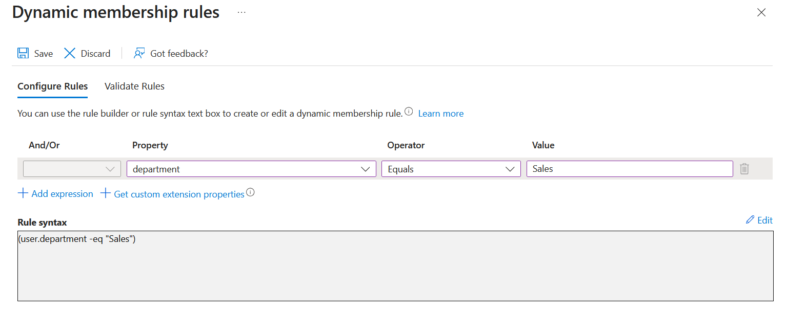
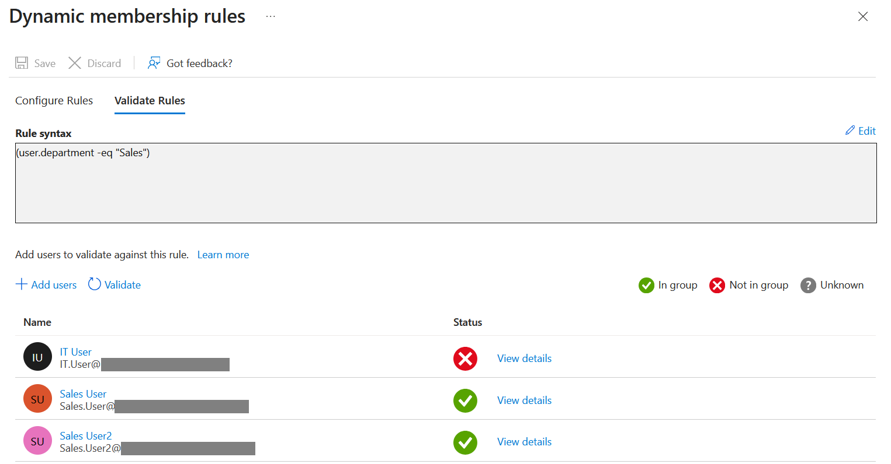
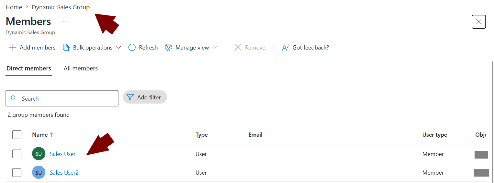
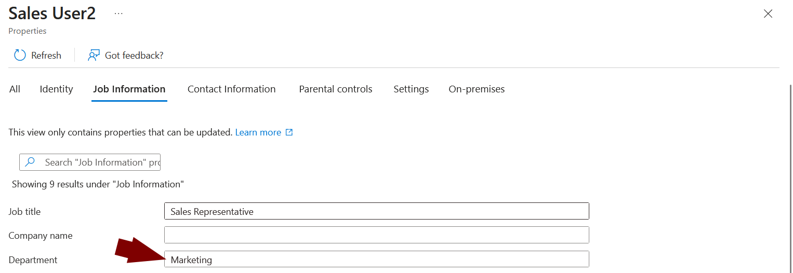
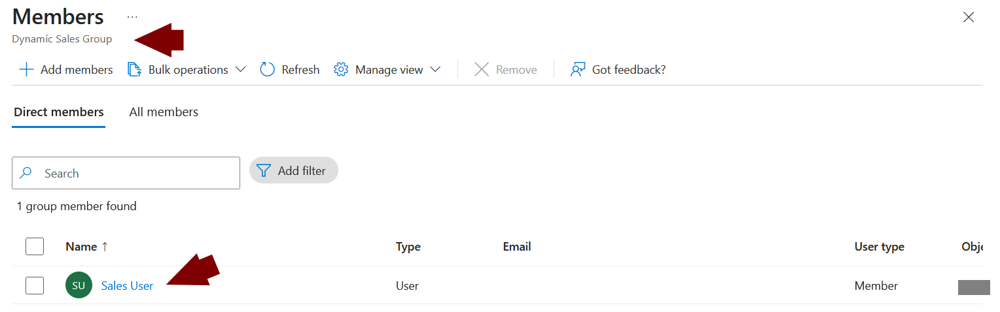

# Lab03 - Dynamic Groups

## Objective

Demonstrate how Microsoft Entra Dynamic Groups automatically manage group membership based on user attributes.

## Scenario

The organization wants all users from the Sales department to be automatically added to a security group without requiring manual membership management.

A Dynamic Group is created using the Department attribute. Users whose Department is set to Sales are automatically included in the group. When a user's department changes, group membership is updated automatically.

## Technologies Used

* Microsoft Entra ID
* Dynamic Groups
* Dynamic Membership Rules
* User Attributes
* Security Groups

## Steps

### 1. Create Sales Users

Create two users with the Department attribute set to Sales.





### 2. Create an IT User

Create a user with the Department attribute set to IT.



### 3. Create a Dynamic Security Group

Create a new Security Group and configure the Membership type as Dynamic User.



### 4. Configure the Dynamic Membership Rule

Configure a rule that automatically includes users whose Department attribute equals Sales.

Rule:

```text
(user.department -eq "Sales")
```



### 5. Validate the Rule

Validate the rule to confirm that Sales users are included and non-Sales users are excluded.



### 6. Verify Dynamic Group Membership

Verify that both Sales users are automatically added to the Dynamic Group.



### 7. Change a User Attribute

Modify the Department attribute of one Sales user from Sales to Marketing.



### 8. Verify Automatic Membership Update

Confirm that the modified user is automatically removed from the Dynamic Group after the attribute change.



## Key Takeaways

* Dynamic Groups eliminate the need for manual membership management.
* Membership is determined by user attributes and dynamic rules.
* Changes to user attributes automatically trigger membership updates.
* Dynamic Groups help automate Identity and Access Management processes at scale.
