# Lab 04 – Conditional Access: Require MFA for Administrative Roles

## Objective

Create a Conditional Access policy in Microsoft Entra ID that requires Multi-Factor Authentication (MFA) for users assigned to the **User Administrator** role.

## Technologies Used

* Microsoft Entra ID
* Conditional Access
* Privileged Identity Management (PIM)
* Role-Based Access Control (RBAC)
* Multi-Factor Authentication (MFA)

## Lab Steps

### 1. Create an administrative user

Created a dedicated administrative account for testing Conditional Access policies.

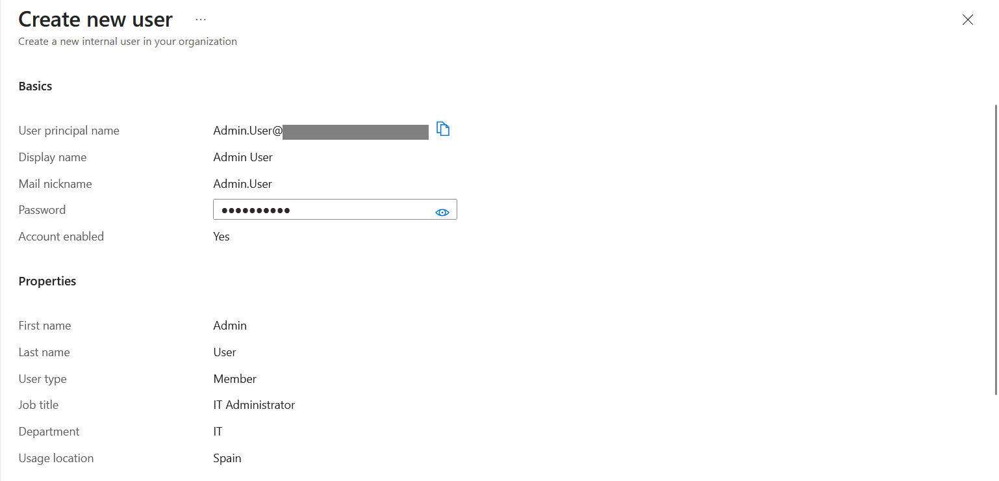

### 2. Assign the User Administrator role

Assigned the User Administrator role through Microsoft Entra Privileged Identity Management (PIM) as an Active role assignment.

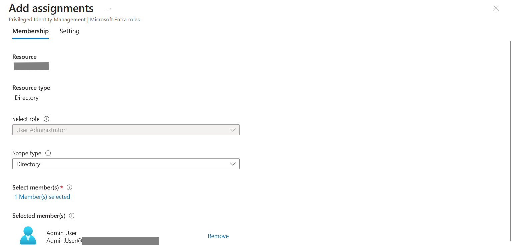

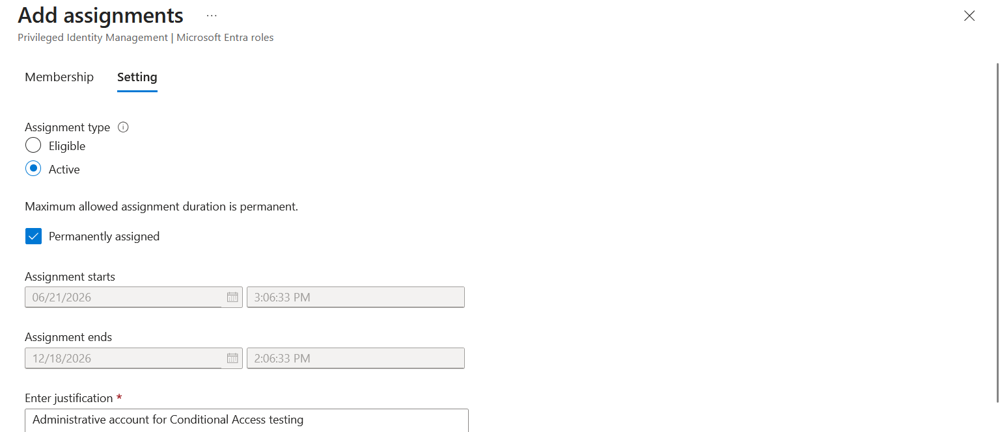

### 3. Disable Security Defaults

Conditional Access policies require Security Defaults to be disabled before they can be configured.

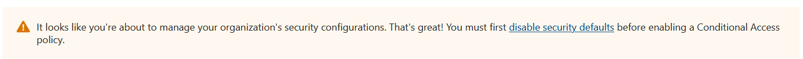

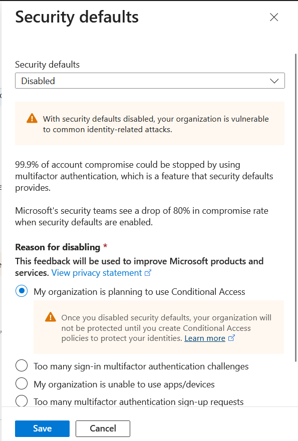

### 4. Create the Conditional Access policy

Created a new Conditional Access policy targeting administrative users.

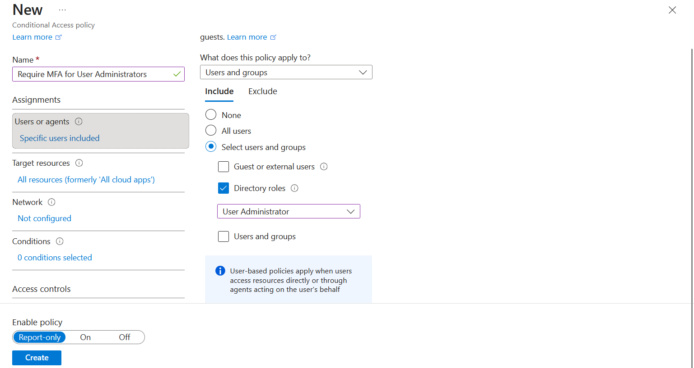

### 5. Configure MFA grant controls

Configured the policy to require Multi-Factor Authentication.

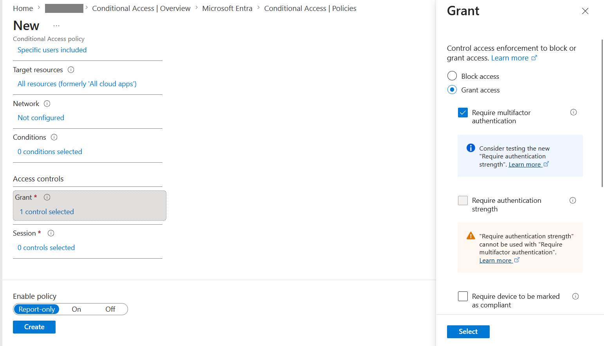

### 6. Review policy configuration

Reviewed the final settings before creating the policy.

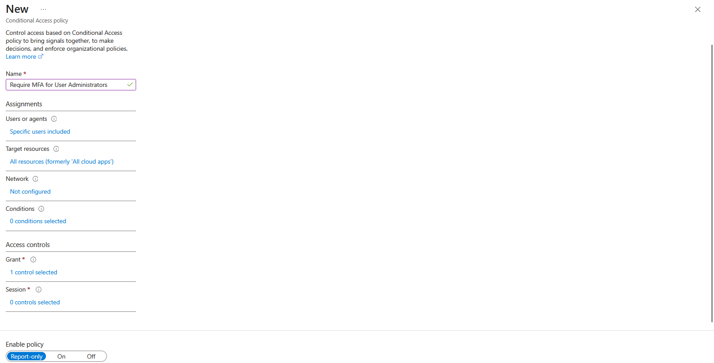

### 7. Create the policy

The policy was created in **Report-only** mode to safely evaluate its impact.

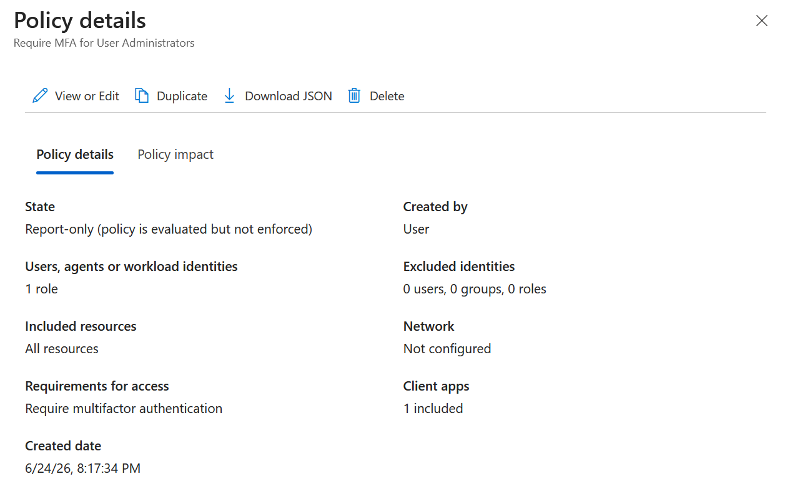

### 8. Test with a User Administrator account

Signed in using the administrative account assigned to the targeted role.

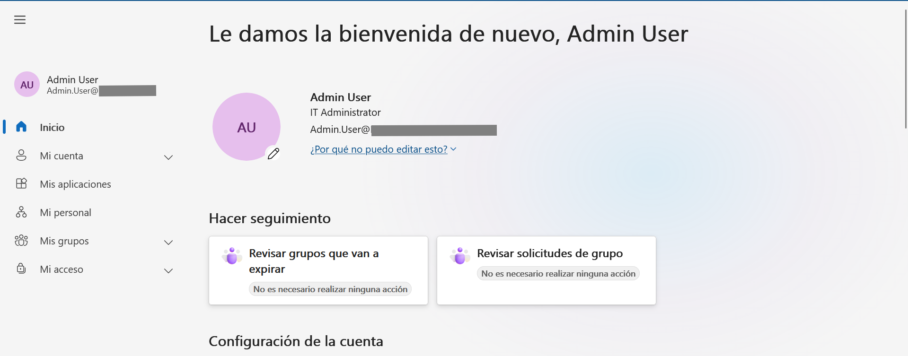

### 9. Validate policy evaluation

Reviewed sign-in logs to confirm that the policy matched the administrative account and would require MFA if enforced.

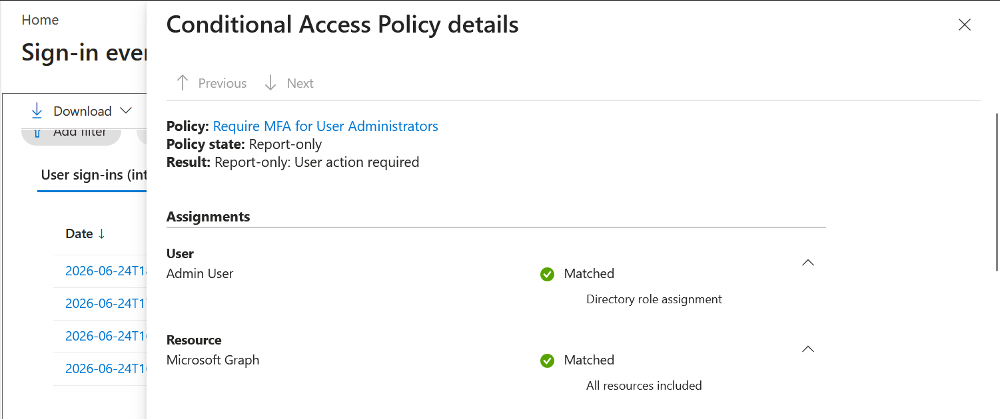

## Key Concepts Demonstrated

* Conditional Access policy creation
* MFA enforcement for privileged roles
* Role-based targeting using User Administrator
* Security Defaults vs Conditional Access
* Report-only mode validation
* Sign-in log analysis and policy evaluation

## Outcome

Successfully created and validated a Conditional Access policy that targets administrative users and requires MFA, following a common enterprise security practice used to protect privileged accounts.
