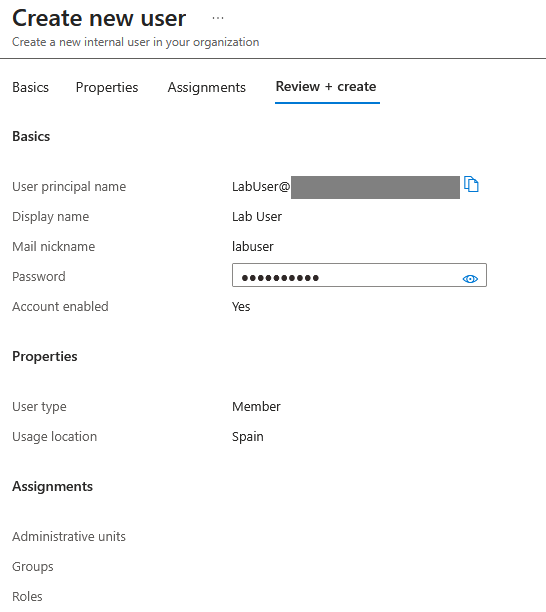
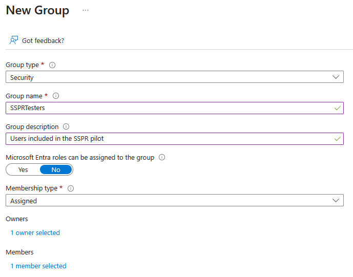
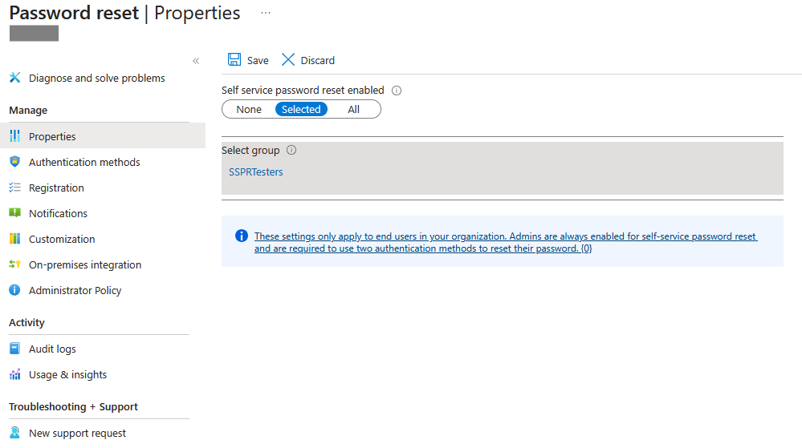
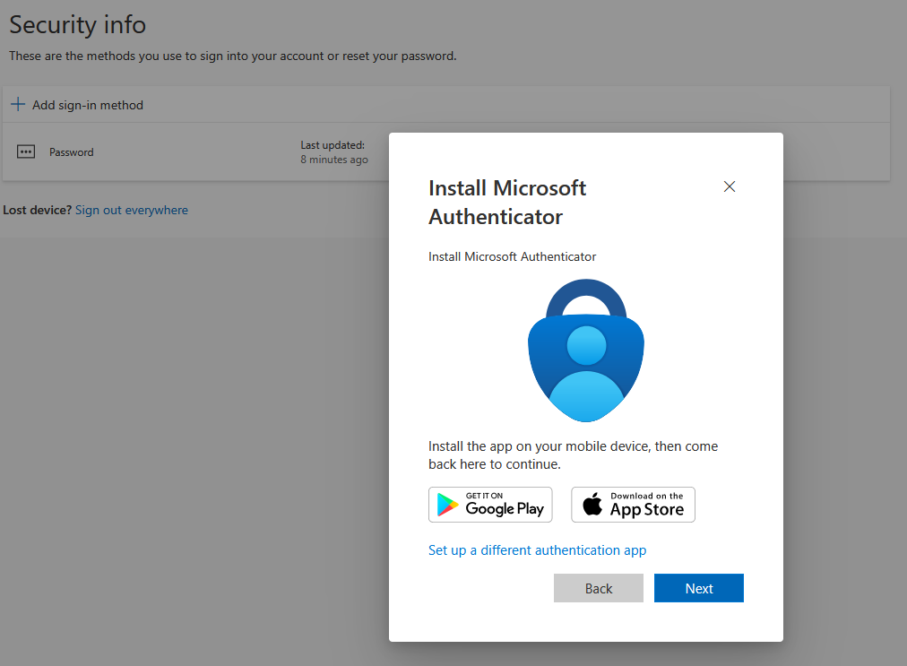
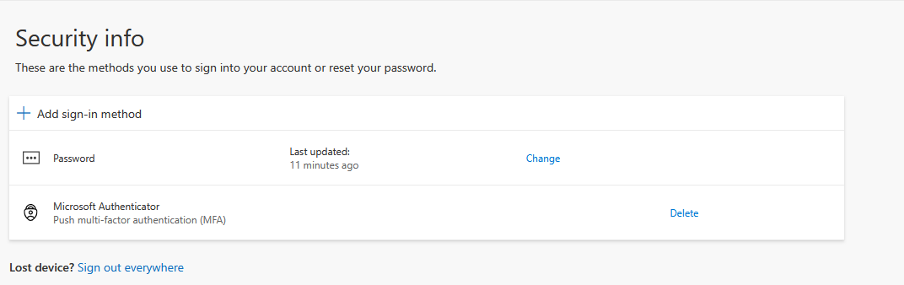
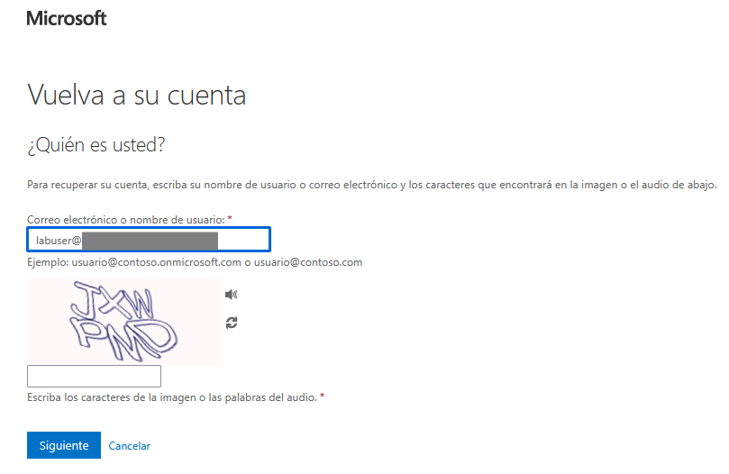
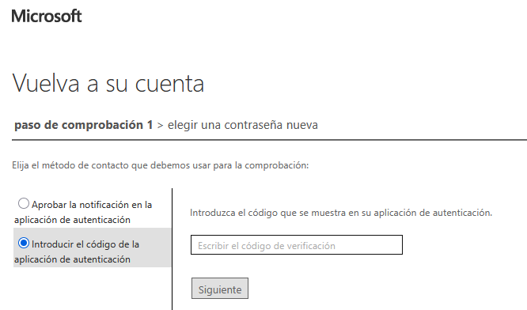
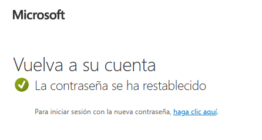

```markdown
# Lab05 - Self-Service Password Reset (SSPR)

## Objective

Demonstrate how Microsoft Entra Self-Service Password Reset (SSPR) enables users to securely reset their own passwords without requiring administrator assistance.

## Scenario

An organization wants to reduce help desk workload by allowing a limited group of users to reset their own passwords.

A pilot deployment is configured using a Security Group to validate the Self-Service Password Reset (SSPR) process before enabling it for a wider audience.

Users must first register a supported authentication method before they can securely verify their identity and reset their password.

## Technologies Used

- Microsoft Entra ID
- Self-Service Password Reset (SSPR)
- Security Groups
- Microsoft Authenticator
- Authentication Methods

## Lab Steps

### 1. Create the test user

A dedicated user account was created to validate the Self-Service Password Reset workflow.



---

### 2. Create the SSPR pilot group

A Security Group was created to limit the SSPR deployment to a controlled set of users.



---

### 3. Add the test user to the pilot group

The test user was added to the Security Group targeted by the SSPR configuration.


---

### 4. Enable Self-Service Password Reset

SSPR was configured for the selected Security Group instead of enabling it for all users.



---

### 5. Register Microsoft Authenticator

The user registered Microsoft Authenticator as the authentication method required for password recovery.



---

### 6. Verify the authentication method

The Microsoft Authenticator registration was successfully completed.



---

### 7. Start the password reset process

The user initiated the Self-Service Password Reset workflow from the Microsoft sign-in page.



---

### 8. Verify the user's identity

The user's identity was verified using Microsoft Authenticator before allowing the password reset.



---

### 9. Reset the password successfully

After successful identity verification, the user was able to reset the password without administrator intervention.



---

## Key Security Concepts Demonstrated

- Self-Service Password Reset (SSPR)
- Authentication Methods
- Microsoft Authenticator
- Security Groups
- Identity Verification
- Least Administrative Effort
- Password Recovery

## Outcome

This lab demonstrates how Microsoft Entra Self-Service Password Reset (SSPR) reduces help desk dependency by allowing authorized users to securely verify their identity and reset their own passwords using Microsoft Authenticator.
```
