# Lab06 - Access Reviews

## Objective

Demonstrate how Microsoft Entra Access Reviews can be used to periodically validate user access to business resources, helping organizations enforce the Principle of Least Privilege and support Identity Governance practices.

---

## Scenario

A Finance application is used by multiple employees across the organization.

To ensure that only authorized users retain access over time, an Identity Administrator creates a recurring Access Review for the Finance application security group.

During the review, Microsoft Entra provides recommendations based on user activity, allowing the reviewer to validate whether access should be maintained or removed according to business requirements.

---

## Technologies Used

- Microsoft Entra ID
- Microsoft Entra ID Governance
- Access Reviews
- Security Groups
- Principle of Least Privilege

---

## Lab Steps

### 1. Prepare the Finance application security group

A dedicated security group representing users with access to the Finance application was prepared with four test users.

Using a dedicated security group allows access to be reviewed collectively instead of evaluating individual permissions.

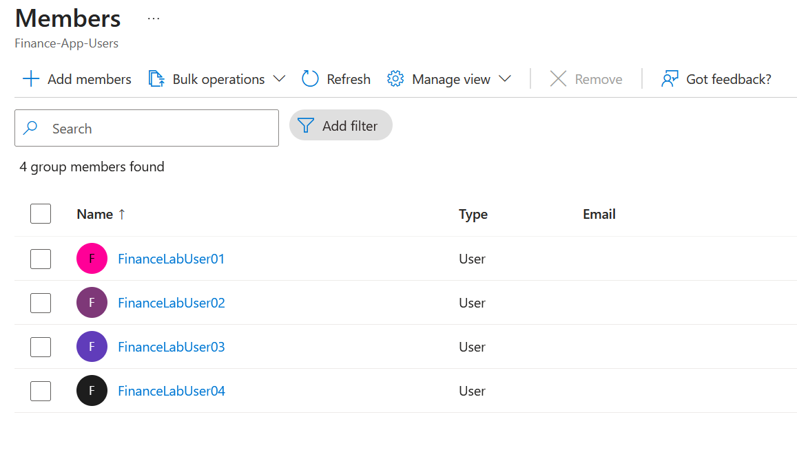

---

### 2. Create an Access Review

A new Access Review was created for the Finance application security group.

The review scope was configured to evaluate all members of the group, ensuring that every assigned user is periodically validated.

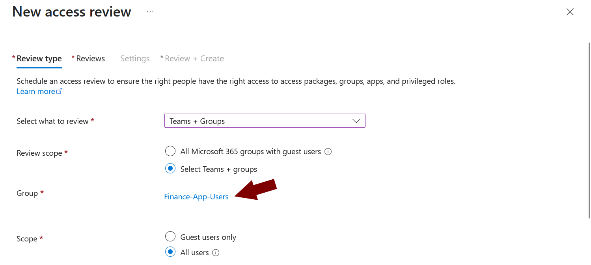

---

### 3. Configure review settings

The review was configured as a recurring quarterly process, with the Global Administrator acting as the reviewer.

Quarterly reviews are commonly used in enterprise environments to regularly validate access to business-critical applications.

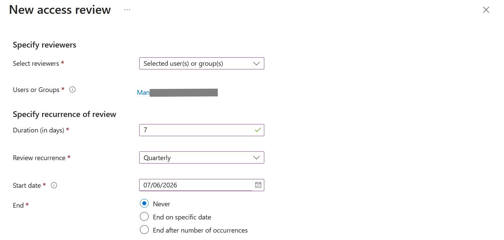

---

### 4. Configure governance options

Additional governance settings were enabled to strengthen the review process.

Inactive user recommendations, mandatory justification, email notifications and reminder emails were configured to improve accountability and support informed access decisions.

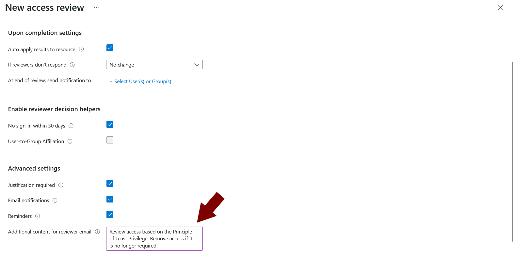

---

### 5. Review configuration summary

A descriptive name and purpose were assigned to the Access Review before creation.

Clear naming improves governance, administration and future audits.

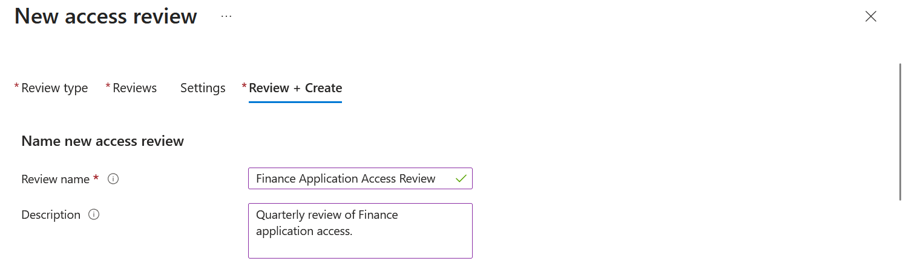

---

### 6. Deploy the Access Review

The Access Review was successfully created and initialized within Microsoft Entra ID.

Once deployed, Microsoft Entra automatically prepared the review according to the configured schedule.

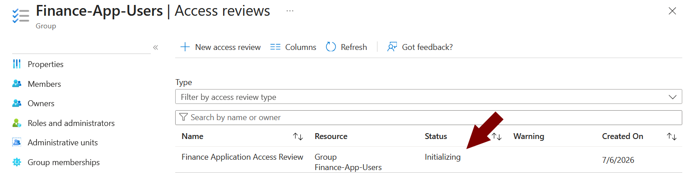

---

### 7. Receive the review notification

Microsoft Entra automatically notified the reviewer by email that a new Access Review required attention.

Email notifications help ensure that periodic access reviews are completed on time.

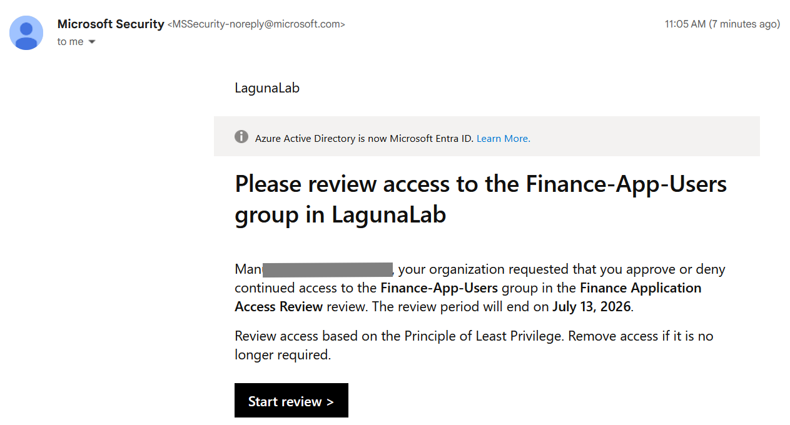

---

### 8. Review user access

Microsoft Entra generated recommendations based on user activity.

Because the users had not signed in recently, the system recommended denying their continued access. These recommendations assist reviewers but do not replace human decision-making.

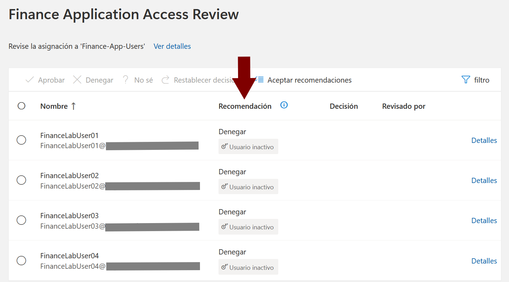

---

### 9. Justify access removal

When denying access, a business justification was provided.

Documenting review decisions improves auditability, accountability and compliance with Identity Governance policies.

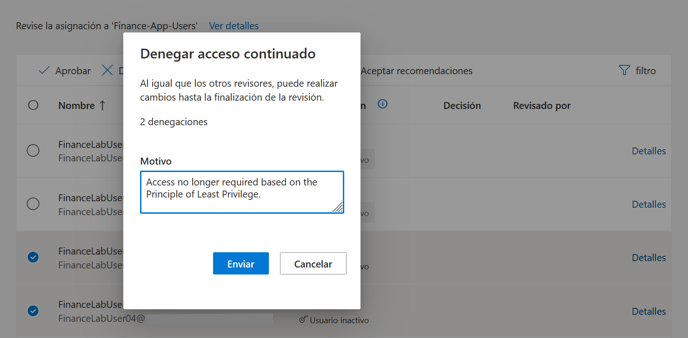

---

### 10. Complete the Access Review

The reviewer completed the Access Review by approving access for two users and denying access for two inactive users.

This demonstrates how periodic reviews help organizations remove unnecessary access while maintaining legitimate business access.

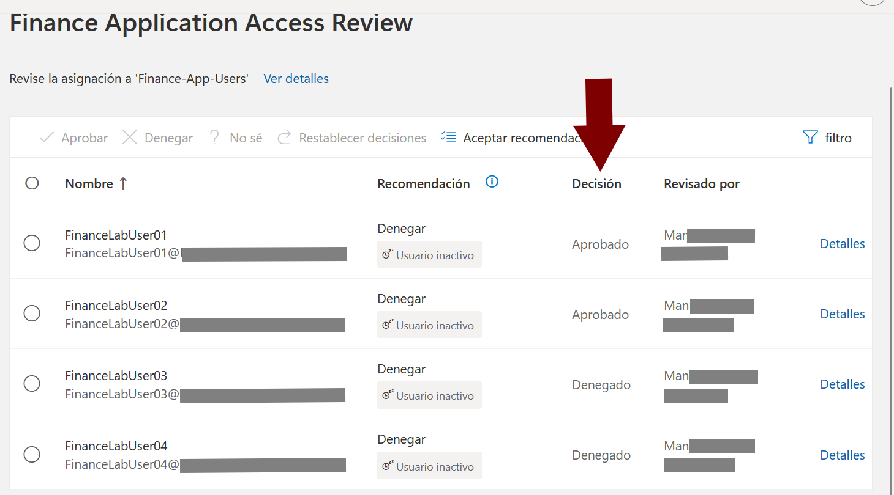

---

### 11. Review the results

The Access Review dashboard provides a consolidated overview of the review results, including approved and denied users.

This summary helps administrators quickly verify the outcome of the review and supports governance and audit activities.

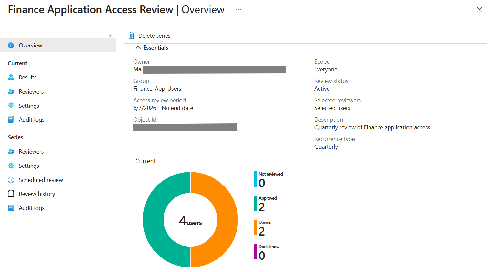

---

## Key Security Concepts Demonstrated

- Identity Governance and Administration
- Access Reviews
- Principle of Least Privilege
- Periodic Access Certification
- Access Lifecycle Management
- Auditability and Accountability
- Risk-based Access Recommendations

---

## Outcome

This lab demonstrates how Microsoft Entra Access Reviews support Identity Governance by periodically validating user access to business resources.

By combining recurring access reviews, reviewer accountability and Microsoft Entra recommendations, organizations can reduce excessive permissions, improve compliance and maintain the Principle of Least Privilege throughout the access lifecycle.
