# Lab07 - Microsoft Entra ID Access Packages (Entitlement Management)

## Objective

This lab demonstrates how to implement entitlement management using Microsoft Entra ID Entitlement Management and Access Packages.

A Finance catalog was created to centralize application resources, publish an Access Package, and assign controlled access to authorized users. The configuration includes resource organization, request policy, assignment lifecycle, and administrative assignment, following the Principle of Least Privilege.

> **Note**
>
> Microsoft Entra ID Governance features used in this lab required enabling the **Microsoft Entra ID Governance Add-on for Microsoft Entra ID P2 (Trial)** because they are not included in the standard Microsoft Entra ID P2 license.
>
## Architecture

```
Finance Catalog
        │
        ▼
Finance-App-Users (Security Group)
        │
        ▼
Finance Application Access (Access Package)
        │
        ▼
Initial Policy
        │
        ▼
Administrative Assignment
        │
        ▼
FinanceLabUser01
```

The Access Package centralizes access to the Finance application by grouping resources into a catalog and applying a controlled assignment policy. Instead of assigning users directly to security groups, administrators manage access through a governed entitlement management workflow.
The Access Package acts as the governance layer between users and protected resources.

## Prerequisites

- Microsoft Entra ID P2 tenant
- Microsoft Entra ID Governance Add-on for Microsoft Entra ID P2 (Trial)
- Identity Governance enabled
- Existing security group (`Finance-App-Users`)
- Test users for administrative assignment
- Global Administrator or Identity Governance Administrator permissions

## Implementation

### 1. Create a Finance Catalog

A dedicated catalog was created to organize Finance application resources. The catalog was initially configured as disabled because access packages are typically published only after their configuration has been completed and validated.

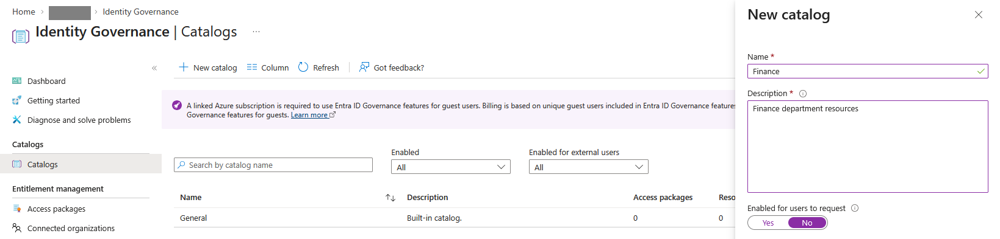

---

### 2. Verify the Catalog

After creation, the catalog properties were verified to confirm that it was successfully created and that user requests remained disabled until publication.

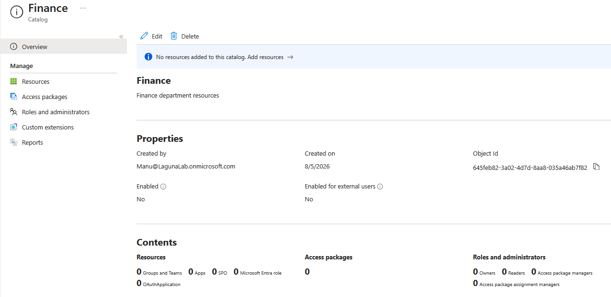

---

### 3. Add Resources to the Catalog

The existing security group **Finance-App-Users** was added as a managed resource. This group represents the users authorized to access the Finance application.

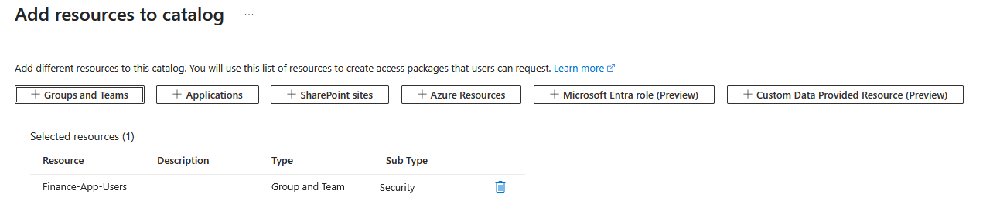

---

### 4. Create the Access Package

A new Access Package named **Finance Application Access** was created inside the Finance catalog. This package will be used to manage access to the Finance application through Microsoft Entra Entitlement Management.

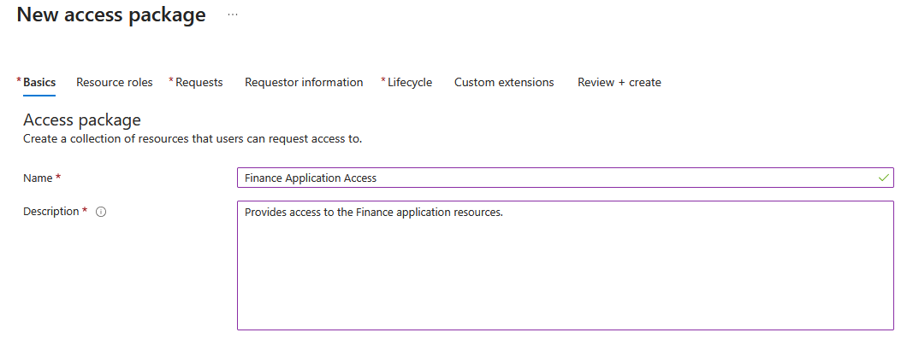

---

### 5. Configure Resource Roles

The **Member** role was assigned to the Finance security group so that users receiving the Access Package automatically become members of the group.

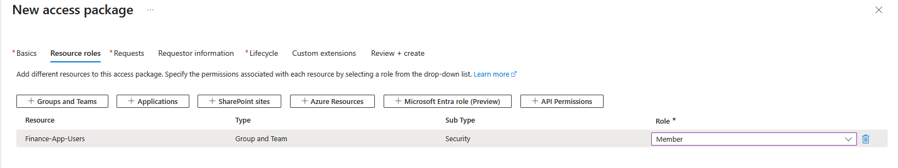

---

### 6. Configure the Request Policy

The request policy was configured to allow only administrator direct assignments. Request justification was enabled, while approval workflows were not required for this lab.

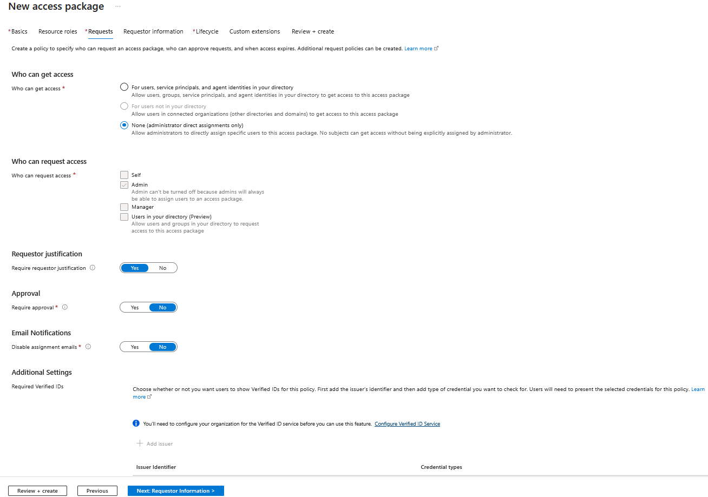

---

### 7. Configure the Assignment Lifecycle

Assignments were configured to expire after **365 days**, allowing periodic access renewal while preventing permanent permissions.

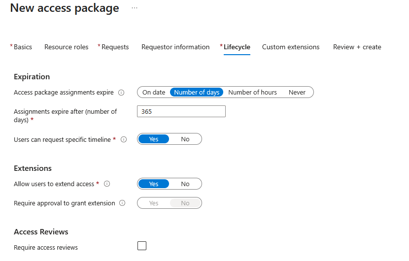

---

### 8. Review the Access Package Configuration

The complete Access Package configuration was reviewed before creation to verify that all settings matched the intended assignment policy.

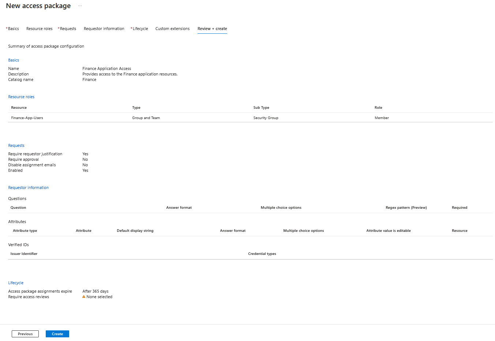

---

### 9. Create the Access Package

After validation, the Access Package was successfully created and became available within the Finance catalog.

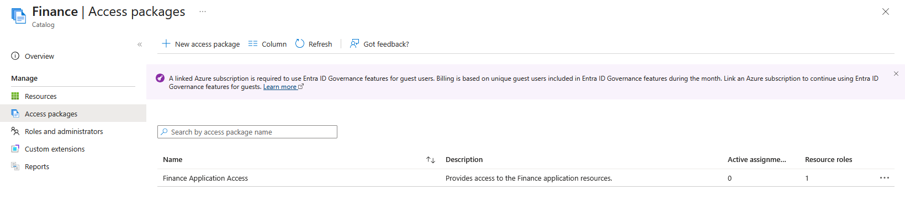

---

### 10. Assign the Access Package

The Access Package was administratively assigned to **FinanceLabUser01**, including a business justification documenting the access requirement.

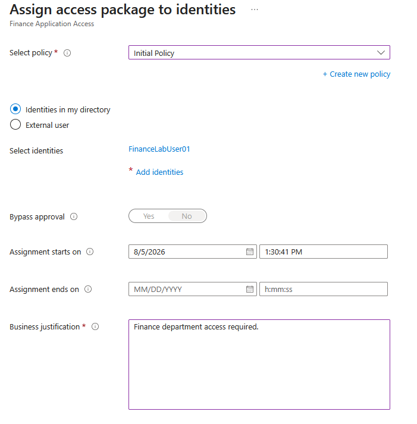

---

### 11. Verify the Assignment

The completed assignment was verified. The package was successfully delivered, and the assignment expiration date reflected the configured lifecycle policy.

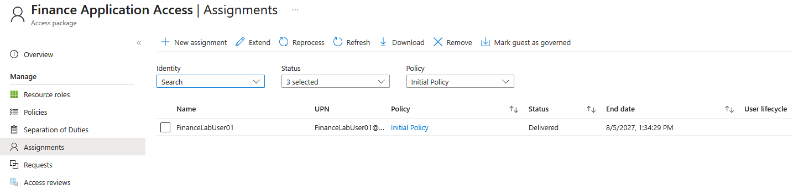

---

## Key Security Concepts Demonstrated

- Identity Governance
- Identity Governance and Administration (IGA)
- Entitlement Management
- Access Packages
- Catalogs
- Administrative Assignments
- Assignment Policies
- Access Lifecycle Management
- Principle of Least Privilege
- Role-Based Access Control (RBAC)

---

## Outcome

This lab demonstrates how Microsoft Entra ID Access Packages simplify access management by grouping resources into a governed Access Package that can be assigned through a standardized process.

Rather than assigning users directly to security groups or individual resources, administrators publish Access Packages that centralize permissions, improve consistency and support Identity Governance and Administration (IGA) throughout the access lifecycle.

---

## Notes

This lab required enabling the **Microsoft Entra ID Governance Add-on for Microsoft Entra ID P2 (Trial)** because several Entitlement Management features are not included in the standard Microsoft Entra ID P2 license.
The trial license was enabled exclusively for laboratory purposes in order to evaluate Entitlement Management capabilities.
Without this add-on, advanced Entitlement Management capabilities such as Access Packages are unavailable.

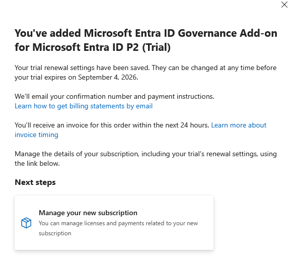
