# Lab08 - Self-Service Access Packages with Approval

## Implementing Self-Service Access Requests using Microsoft Entra Entitlement Management

## Objective

The objective of this lab is to implement a self-service access request workflow using Microsoft Entra Entitlement Management.

In this scenario, a Support Technician requests temporary access to Finance resources through an Access Package. The request is reviewed and approved by a Finance Manager, after which Microsoft Entra automatically grants access to multiple resources, including security groups, Microsoft 365 groups, and an enterprise application.

This lab demonstrates how Identity Governance simplifies access management by combining self-service requests, approval workflows, automated resource assignment, and time-limited access.

## Architecture

The following diagram illustrates the access request workflow implemented in this lab:

```text
Support Tech
     │
     │ Requests access
     ▼
Finance Employee Access Package
     │
     │ Approval required
     ▼
Finance Manager
     │
     │ Approves request
     ▼
Microsoft Entra Entitlement Management
     │
     ├──────────────► Finance-App-Users (Security Group)
     │
     ├──────────────► Finance Collaboration (Microsoft 365 Group)
     │
     └──────────────► ServiceNow (Enterprise Application)
```

After approval, Microsoft Entra automatically assigns all resources included in the Access Package. Access is granted only for the requested period and is managed through Entitlement Management policies.

## Prerequisites

Before starting this lab, the following resources should already be available:

- A Microsoft Entra ID tenant with Microsoft Entra ID Governance enabled.
- A catalog created in Entitlement Management.
- A Security Group (`Finance-App-Users`).
- A Microsoft 365 Group (`Finance Collaboration`).
- An Enterprise Application (`ServiceNow`).
- Three test users:
  - **Support Tech** (Requestor)
  - **Finance Manager** (Approver)
  - **Global Administrator** (to configure the Access Package)
- Appropriate administrative permissions to manage Entitlement Management.

  ## Step 1 - Create the Access Package

A new Access Package named **Finance Employee Access** was created within the existing Entitlement Management catalog.

The Access Package acts as a container that groups multiple resources under a single entitlement, allowing administrators to manage access through a centralized governance process instead of assigning permissions individually.

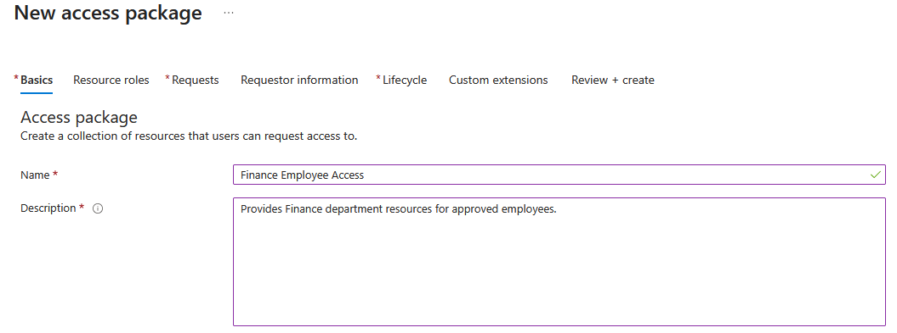

## Step 2 - Configure Resource Roles

Three different resource types were added to the Access Package:

- **Finance-App-Users** (Security Group)
- **Finance Collaboration** (Microsoft 365 Group)
- **ServiceNow** (Enterprise Application)

Each resource was assigned the appropriate role, allowing Microsoft Entra to automatically grant the required permissions when the Access Package is approved.

This demonstrates one of the main advantages of Entitlement Management: multiple resources can be assigned through a single governed request instead of managing each permission individually.

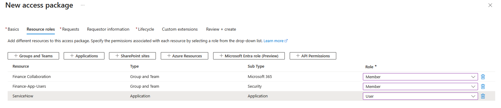

## Step 3 - Configure the Request Policy

The Access Package request policy was configured to allow **self-service requests** from authorized users.

Only the **Support Tech** user was allowed to request the Access Package, ensuring that access could only be requested by approved personnel. Request justification was also required so that each request included a business reason before entering the approval workflow.

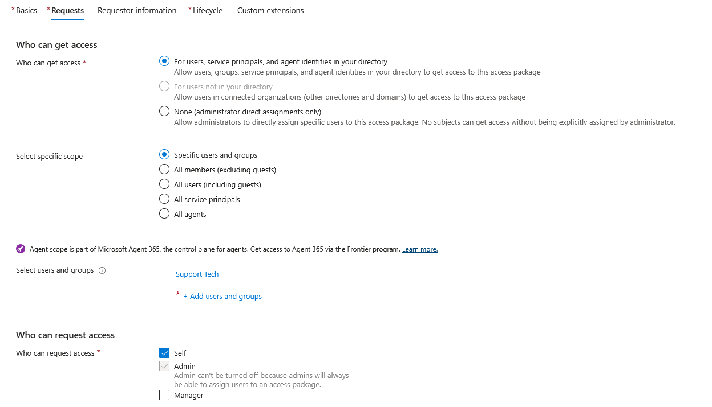

Approval was enabled using a **single-stage approval workflow**. The **Finance Manager** was designated as the approver and was required to provide a justification when approving or denying requests.

This configuration ensures that access is not granted automatically and that every request is reviewed before Microsoft Entra assigns the associated resources.

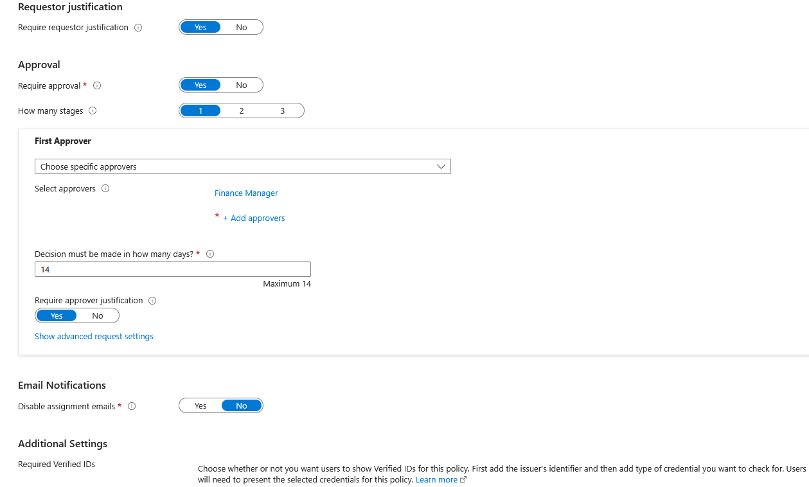

## Step 4 - Configure the Assignment Lifecycle

The Access Package assignment lifecycle was configured to provide **temporary access** instead of permanent permissions.

Assignments were set to expire after **365 days**, while users were allowed to request a specific access period when submitting their request. Access extensions were also enabled but required approval, ensuring that long-term access remained subject to governance.

This approach supports the **Principle of Least Privilege** by granting access only for the required period and requiring additional approval for any extension.

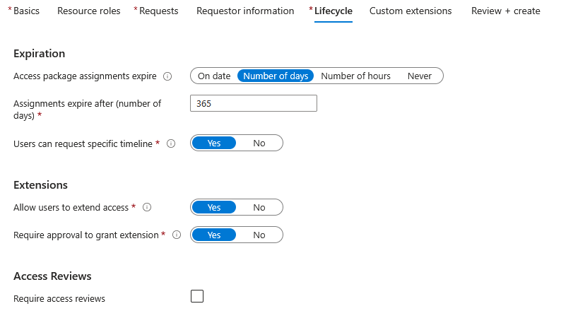

## Step 5 - Review and Create the Access Package

Before creating the Access Package, the complete configuration was reviewed to verify that all settings matched the intended governance model.

The review included the configured resources, request policy, approval workflow, and assignment lifecycle to ensure that the Access Package would behave as expected once published.

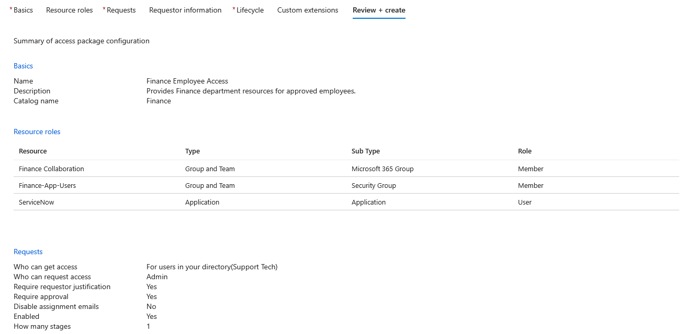

After validation, the Access Package was created and became available for self-service requests through Microsoft Entra Entitlement Management.

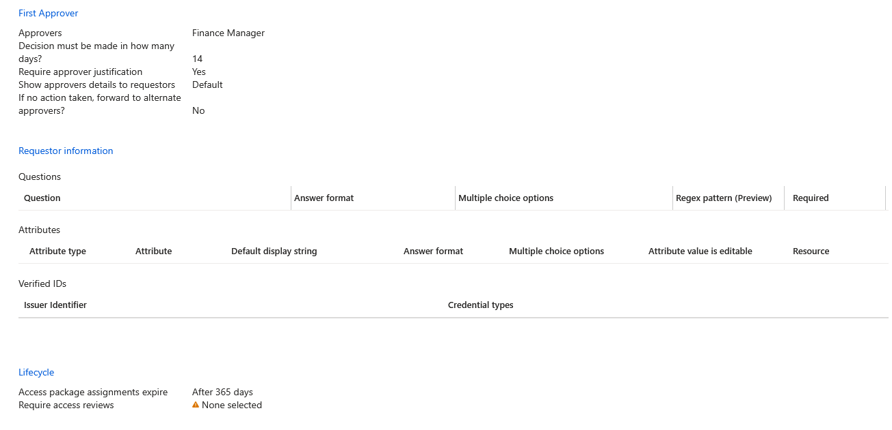

## Step 6 - Request the Access Package

After the Access Package was published, **Support Tech** signed in to the **My Access Portal** to request temporary access to Finance resources.

The available Access Package was presented to the user, allowing the request to be initiated without requiring manual intervention from the IT department.

This self-service model reduces administrative overhead while ensuring that access requests remain governed through approval policies.

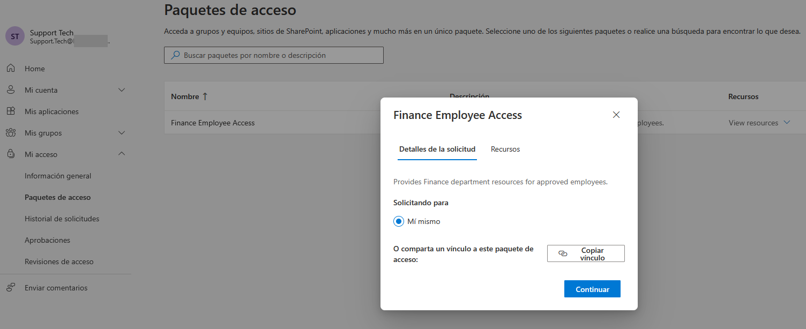

## Step 7 - Submit the Access Request

Support Tech submitted the access request by specifying the required access period and providing a business justification explaining why temporary access to Finance resources was needed.

Including a justification allows approvers to make informed decisions and provides an audit trail for future reviews.

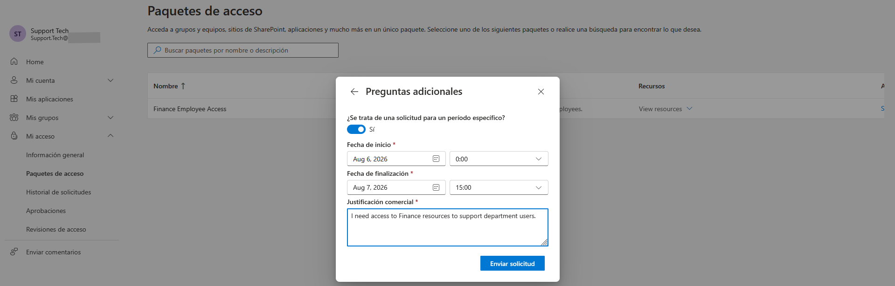

## Step 8 - Verify the Submitted Request

After submission, the request entered the **Pending approval** state.

The request details displayed the requested resources, assignment duration, and business justification while waiting for the designated approver to review the request.

This confirms that Microsoft Entra successfully initiated the approval workflow defined in the Access Package policy.

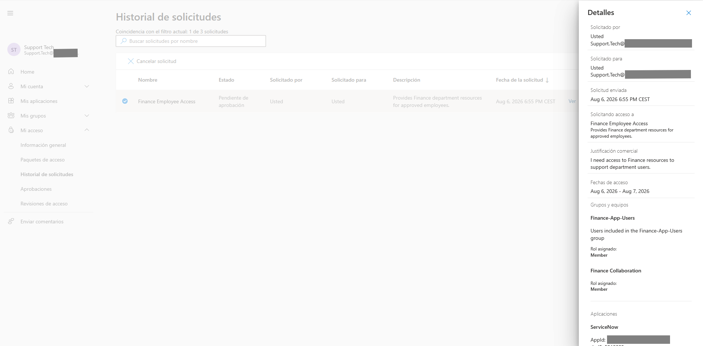

## Step 9 - Approve the Access Request

The pending request was reviewed by **Finance Manager**, who evaluated the business justification submitted by Support Tech before approving the request.

A justification for the approval decision was also provided, creating a complete audit trail for both the requester and the approver.

This approval process ensures that access is granted only after appropriate authorization, reducing the risk of unauthorized access to sensitive resources.

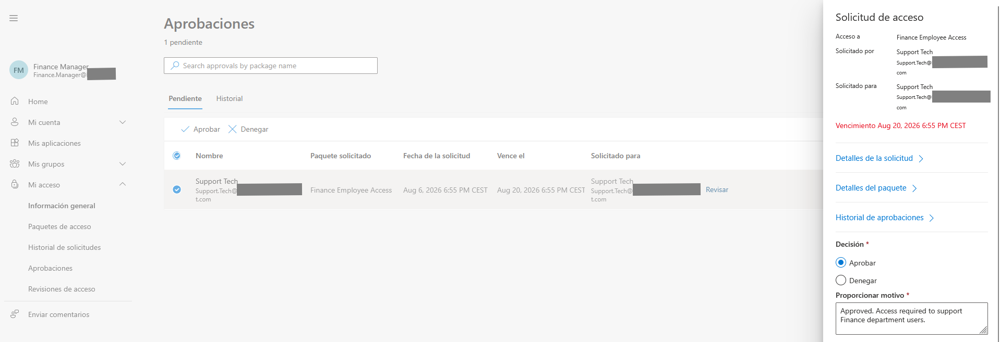

## Step 10 - Verify the Approved Assignment

After approval, the Access Package became active for **Support Tech**.

Microsoft Entra automatically assigned all resources included in the Access Package without requiring any additional administrative actions.

This demonstrates how Entitlement Management automates access provisioning while maintaining governance through approval policies.

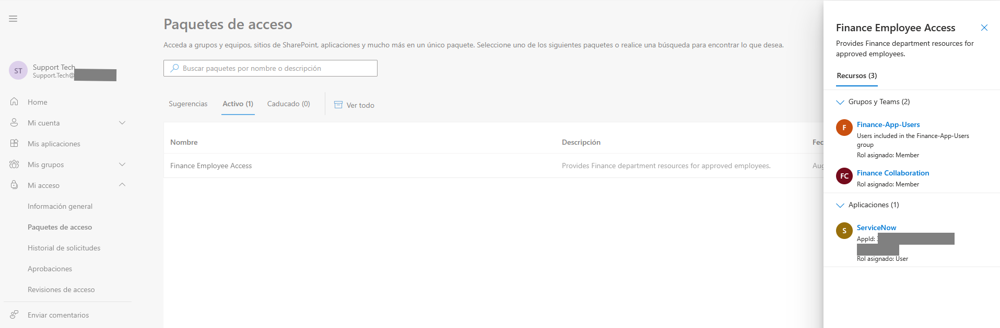

## Step 11 - Verify Group Memberships

The group memberships assigned through the Access Package were verified after the approval process.

Support Tech was automatically added to both the **Finance-App-Users** security group and the **Finance Collaboration** Microsoft 365 group, confirming that group-based resource assignments were successfully provisioned.

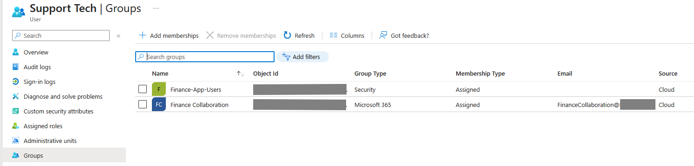

## Step 12 - Verify Enterprise Application Assignment

Finally, the enterprise application assignment was verified.

Support Tech was automatically assigned the **User** role for the **ServiceNow** enterprise application, demonstrating that Access Packages can provision different resource types—including security groups, Microsoft 365 groups, and enterprise applications—through a single governed request.

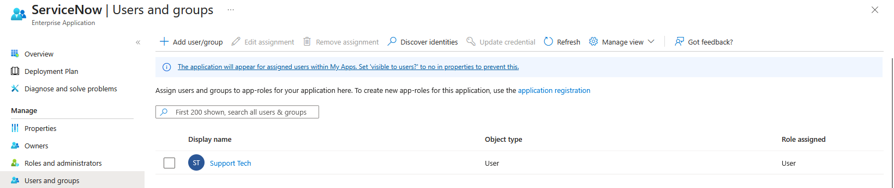

## Conclusion

This lab demonstrated how Microsoft Entra Entitlement Management enables a governed self-service access model through Access Packages.

Instead of relying on manual permission assignments or IT service tickets, authorized users can request temporary access to business resources. Access requests are reviewed through an approval workflow, after which Microsoft Entra automatically provisions the required resources while maintaining centralized governance and auditability.

## Key Takeaways

- Implemented self-service access requests using Microsoft Entra Entitlement Management.
- Configured a single-stage approval workflow for Access Package requests.
- Assigned multiple resource types through a single Access Package.
- Applied temporary access with lifecycle management and approval-based extensions.
- Verified automatic provisioning of security groups, Microsoft 365 groups, and enterprise applications.

## Technologies Used

- Microsoft Entra ID
- Microsoft Entra Entitlement Management
- Identity Governance
- Access Packages
- Self-Service Access Requests
- Approval Workflows
- Microsoft 365 Groups
- Security Groups
- Enterprise Applications
- ServiceNow


