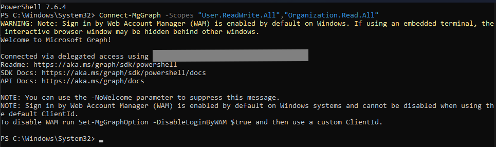
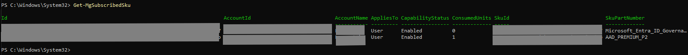
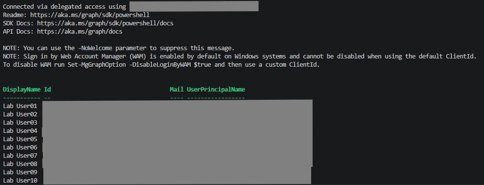
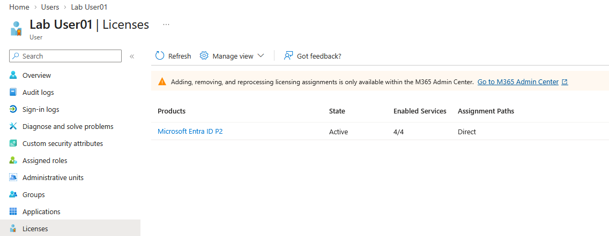

# PowerShell + Microsoft Graph Lab 01 - Bulk License Assignment

## Overview

This lab demonstrates how to automate bulk Microsoft Entra ID P2 license assignment using Microsoft Graph PowerShell.

Instead of assigning licenses manually through the Microsoft Entra admin center, a PowerShell script retrieves the target users and assigns Microsoft Entra ID P2 licenses automatically in a consistent and repeatable way.

## Objectives

- Connect to Microsoft Graph using delegated permissions.
- Retrieve the Microsoft Entra ID P2 subscription SKU.
- Retrieve target users dynamically.
- Assign Microsoft Entra ID P2 licenses in bulk.
- Verify successful license assignment.

## Technologies Used

- Microsoft Entra ID
- Microsoft Graph PowerShell SDK
- PowerShell 7
- Visual Studio Code

---

## Step 1 - Connect to Microsoft Graph

The first step is to establish an authenticated session with Microsoft Graph using delegated permissions.

The required scopes provide permission to retrieve users and assign Microsoft Entra ID licenses.

---

## Step 2 - Retrieve Available License Subscriptions

The available license subscriptions are retrieved to identify the Microsoft Entra ID P2 SKU required for the bulk assignment process.

The SKU ID is later used by the PowerShell script to assign licenses programmatically.

---

## Step 3 - Execute the Bulk License Assignment Script

The PowerShell script retrieves the target users dynamically and assigns the Microsoft Entra ID P2 license to each user.

This approach eliminates repetitive manual tasks and provides a consistent method for bulk license assignment.

---

## Step 4 - Verify License Assignment

After the script execution, the assigned license is verified from the Microsoft Entra admin center.

The user now has an active Microsoft Entra ID P2 license assigned successfully.

---

## Conclusion

This lab demonstrated how Microsoft Graph PowerShell can be used to automate bulk Microsoft Entra ID P2 license assignment.

Automating repetitive administrative tasks improves efficiency, reduces manual errors, and provides a scalable approach to identity management.

---

## Key Takeaways

- Connected to Microsoft Graph using delegated permissions.
- Retrieved the Microsoft Entra ID P2 subscription SKU.
- Assigned Microsoft Entra ID P2 licenses to multiple users using PowerShell.
- Verified the successful license assignment in the Microsoft Entra admin center.
